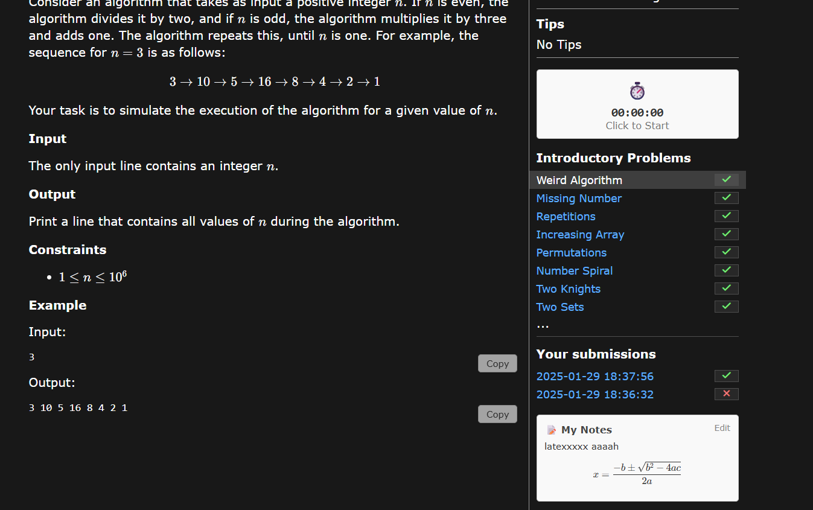
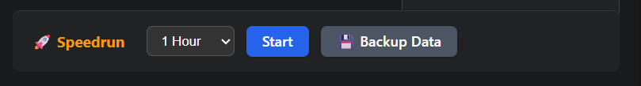
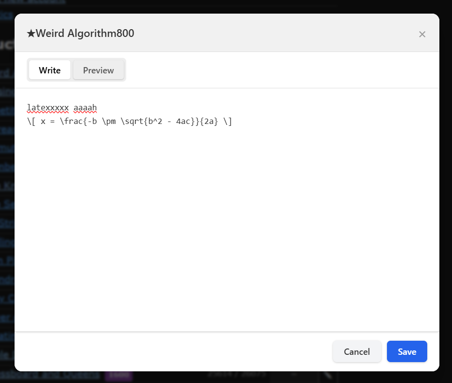

# CSES Enhanced 🏆

A browser extension that supercharges your competitive programming training on [CSES.fi](https://cses.fi).

### 🚀 [Install for Free on Microsoft Edge](https://shorturl.at/QNMSK)
*(Compatible with Chrome, Brave, Vivaldi and others via manual install)*

---

## Features
- **Difficulty Ratings:** Adds estimated Elo ratings (800-2400+) to problems.
- **Practice Timer:** Sidebar stopwatch to track your solving speed.
- **Speedrun Mode:** Track how many problems you solve in 1-5 hour sessions.
- **Enhanced Notes:** Write personal notes with full LaTeX math support.

## Screenshots

| Difficulty Ratings | Timer & LaTeX Support |
|:---:|:---:|
|  |  |
| **Speedrun Mode** | **Saved Notes** |
|  |  |

## Installation (Manual)
If you prefer not to use the store or want to develop locally:
1. Download the latest release from the "Releases" tab.
2. Unzip the folder.
3. Go to `chrome://extensions` (or `edge://extensions`).
4. Enable **Developer Mode**.
5. Click **Load Unpacked** and select the folder.

## Tech Stack
- JavaScript (Vanilla)
- CSS (Native Dark Mode)
- KaTeX (Math Rendering)
